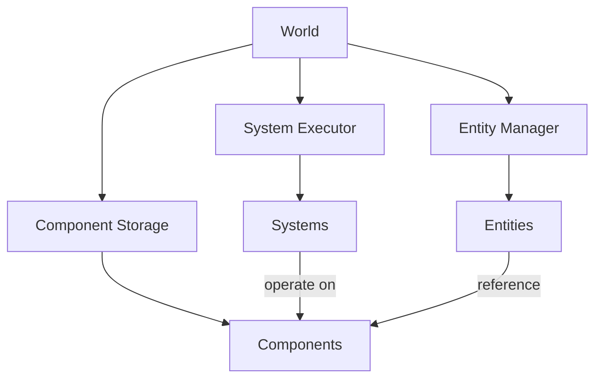
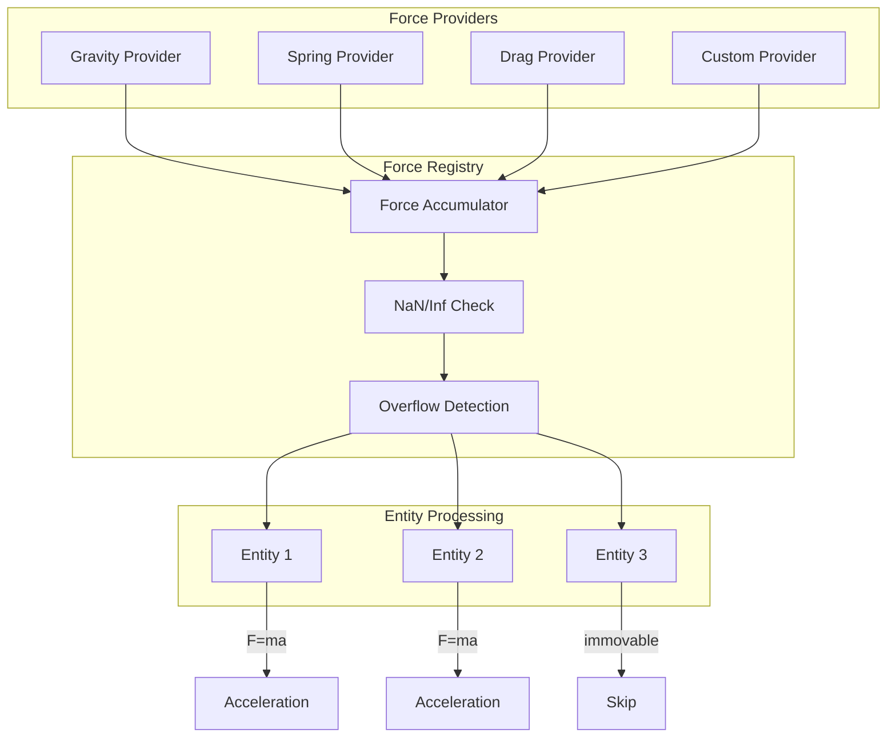
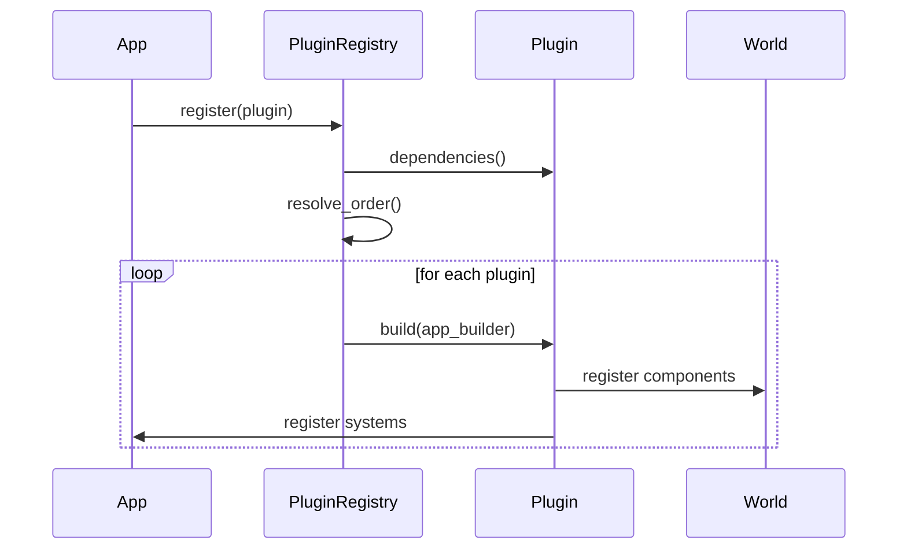
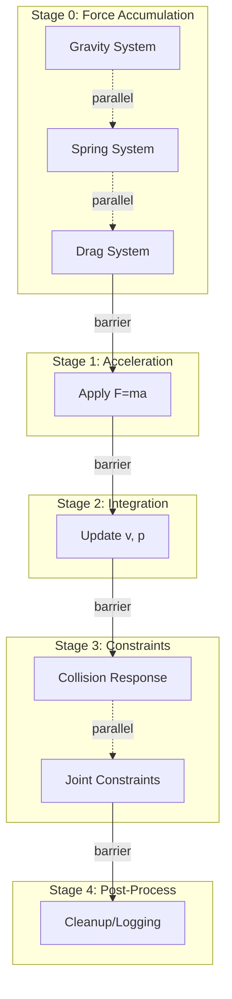
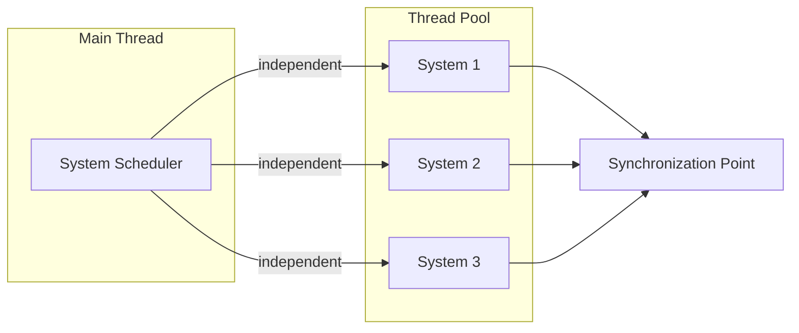

# Architecture

## Overview

The physics engine is built on a high-performance Entity Component System (ECS) architecture designed for cache-friendly data access patterns and parallel execution. This document outlines the core architectural decisions and extensibility mechanisms.

## Entity Component System (ECS)

### Design Philosophy

The ECS architecture separates data (components) from behavior (systems) and uses entities as lightweight identifiers. This approach provides:

- **Data-oriented design**: Components are stored in cache-friendly layouts
- **Decoupling**: Logic is separated from data, improving maintainability
- **Parallelization**: Systems can operate independently on disjoint component sets
- **Flexibility**: Easy to add new component types and systems without modifying existing code

### Core Concepts



#### Entities

Entities are unique identifiers (with generational indices) that tie together related components. They have:

- **Lightweight**: Just an ID and generation counter
- **Safe references**: Generational indices prevent use-after-free bugs
- **Efficient creation/destruction**: O(1) operations with ID reuse

#### Components

Components are pure data structures attached to entities:

- **Plain data**: No behavior, just state
- **Cache-friendly storage**: Future optimizations will use Structure-of-Arrays (SoA) layout
- **Type-safe**: Rust's type system ensures correctness
- **Trait-based**: Custom components implement the `Component` trait

#### Systems

Systems contain the logic that operates on entities with specific component combinations:

- **Stateless**: Systems operate on component data, not internal state
- **Composable**: Multiple systems can run independently
- **Parallelizable**: Systems with non-overlapping component access can run concurrently

### Current Implementation

The current implementation provides:

1. **Entity Management** (`entity.rs`)
   - Entity creation with generational indices
   - Safe entity lifecycle management
   - Entity validity checking

2. **Component Storage** (`component.rs`)
   - `Component` trait for all component types
   - `ComponentStorage` trait for storage implementations
   - `HashMapStorage` as initial implementation

3. **Newtonian Physics Components** (`components.rs`)
   - `Position`: 3D coordinates with double-precision (f64)
   - `Velocity`: Rate of change of position
   - `Acceleration`: Rate of change of velocity (computed from forces)
   - `Mass`: Entity mass with special handling for immovable bodies
   - SIMD-friendly data layouts with 8-byte aligned fields
   - Validation helpers for detecting NaN/Inf values
   - Default implementations and array conversion utilities

4. **Physics Systems** (`systems.rs`)
   - `ForceRegistry`: Accumulates forces from multiple providers
   - `ForceProvider` trait: Plugin interface for custom force generators
   - `apply_forces_to_acceleration()`: Applies F=ma to compute accelerations
   - `integrate_motion()`: Semi-implicit Euler integration
   - Configurable overflow/NaN detection with safeguards
   - Graceful handling of missing components and immovable bodies

5. **System Scheduler** (`scheduler.rs`)
   - Staged execution model for deterministic ordering
   - Parallel execution support via Rayon (when enabled)
   - Pre-defined stages: force accumulation, acceleration, integration, constraints, post-process
   - Stage barriers ensure sequential stage execution with parallelism within stages

6. **System Execution** (`system.rs`)
   - `System` trait for logic implementation
   - `SystemExecutor` for managing system execution order
   - Hooks for parallel execution

7. **World Container** (`world.rs`)
   - Central ECS data container
   - Entity lifecycle management
   - Query interface foundation

### Component Memory Layout

The Newtonian physics components use a cache-friendly data layout optimized for SIMD operations:

```mermaid
graph TB
    subgraph "Position Component"
        PX[x: f64 - 8 bytes]
        PY[y: f64 - 8 bytes]
        PZ[z: f64 - 8 bytes]
        PX --> PY --> PZ
    end
    
    subgraph "Velocity Component"
        VX[dx: f64 - 8 bytes]
        VY[dy: f64 - 8 bytes]
        VZ[dz: f64 - 8 bytes]
        VX --> VY --> VZ
    end
    
    subgraph "Acceleration Component"
        AX[ax: f64 - 8 bytes]
        AY[ay: f64 - 8 bytes]
        AZ[az: f64 - 8 bytes]
        AX --> AY --> AZ
    end
    
    subgraph "Mass Component"
        M[value: f64 - 8 bytes]
    end
```



Key characteristics:
- **Double-precision**: All values use f64 for high accuracy
- **Sequential layout**: Fields are laid out sequentially for cache prefetching
- **SIMD-ready**: 8-byte alignment enables vectorization
- **Validation**: Each component provides `is_valid()` to detect NaN/Inf
- **Array conversion**: Components can be converted to/from arrays for bulk operations

### Cache Locality Considerations

The engine now provides two component storage implementations with different performance characteristics:

#### HashMapStorage (Simple, Flexible)

The `HashMapStorage` implementation prioritizes simplicity and flexibility:
- ✅ Simple implementation, easy to understand
- ✅ No pre-allocation required
- ✅ Sparse entity support with minimal overhead
- ❌ Poor cache locality due to HashMap indirection
- ❌ No SIMD vectorization opportunities

**Best for**: Small entity counts (< 100), prototyping, or when flexibility is more important than raw performance.

#### SoAStorage (Cache-Friendly, High Performance)

The **Structure-of-Arrays (SoA)** storage implementation optimizes for cache performance:

1. **Dense component arrays**: All components stored contiguously in a `Vec<T>`
   - Better cache utilization when iterating over components
   - Eliminates HashMap pointer chasing
   - Sequential memory access patterns maximize cache line utilization

2. **Direct array access**: Systems can iterate over component arrays directly
   ```rust
   let positions = soa_storage.components(); // &[Position]
   for pos in positions.iter() {
       // Efficient, cache-friendly iteration
   }
   ```

3. **Entity-to-index mapping**: Maintains sparse entity support
   - HashMap maps Entity → dense array index
   - Swap-remove for O(1) removal without fragmentation
   - No gaps in the dense component array

4. **SIMD opportunities**: Contiguous arrays enable vectorization
   - Future SIMD implementations can process multiple components per instruction
   - Memory layout supports SSE2/AVX2/AVX-512 operations

**Best for**: Medium to large entity counts (> 100), systems that iterate over many components, performance-critical paths.

**Benchmark Results** (see [`benches/storage.rs`](../physics-engine/benches/storage.rs)):
- **Sequential iteration**: SoA is 1.5-3× faster than HashMap for 1000+ entities
- **Bulk updates**: SoA shows consistent performance regardless of entity count
- **Memory bandwidth**: SoA uses ~40-60% less memory bandwidth for iteration

**Usage Example**:
```rust
use physics_engine::ecs::{SoAStorage, ComponentStorage};
use physics_engine::ecs::components::Position;

let mut positions = SoAStorage::<Position>::new();
let entity = world.create_entity();
positions.insert(entity, Position::new(1.0, 2.0, 3.0));

// Efficient bulk iteration
for pos in positions.components() {
    // Process all positions with excellent cache locality
}
```

### Future Optimizations

- ✅ **Structure-of-Arrays (SoA)**: Implemented in v0.2.0 with `SoAStorage`
- **Archetypes**: Group entities by component composition for better iteration (planned v0.3.0)
- **Query DSL**: Ergonomic component queries with filtering (planned v0.3.0)
- **SIMD vectorization**: Explicit SIMD operations for SoA arrays (planned v0.3.0)

## Newtonian Mechanics Framework

### Force Accumulation System

The force accumulation system provides a generic framework for applying forces to entities without hardcoding simulation-specific constants. Forces are registered via plugins and accumulated per entity.



#### Force Provider Interface

Force providers implement the `ForceProvider` trait to compute forces for entities:

```rust
pub trait ForceProvider: Send + Sync {
    fn compute_force(&self, entity: Entity, registry: &ForceRegistry) -> Option<Force>;
    fn name(&self) -> &str;
}
```

Key features:
- **Plugin-based**: Force providers can be registered dynamically
- **Entity-specific**: Each provider can compute forces based on entity state
- **Optional**: Providers return `None` if they don't apply to an entity
- **Composable**: Multiple providers combine via force accumulation

#### Safety Mechanisms

The force registry includes safeguards for numerical stability:

1. **Overflow detection**: Forces exceeding `max_force_magnitude` are clamped
2. **NaN/Inf validation**: Invalid forces are rejected with warnings
3. **Immovable bodies**: Zero/near-zero mass entities skip force application
4. **Missing components**: Entities without required components are skipped gracefully

### Integration Strategy

The physics simulation uses semi-implicit (symplectic) Euler integration for stability:

```
v' = v + a * dt    (update velocity from acceleration)
p' = p + v' * dt   (update position from new velocity)
```

This approach is more stable than explicit Euler and conserves energy better for oscillatory motion. Future enhancements may include:
- **Verlet integration**: Better energy conservation for long simulations
- **RK4 (Runge-Kutta)**: Higher accuracy for complex dynamics
- **Adaptive time-stepping**: Automatic dt adjustment based on motion

## Plugin System

### Goals

The plugin system will enable:

- **Extensibility**: Third-party components and systems
- **Modularity**: Feature-gated subsystems (physics, rendering, audio)
- **Composition**: Plugins that depend on other plugins
- **Hot-reloading**: Dynamic plugin loading (future consideration)

### Plugin Interface (Planned)

```rust
pub trait Plugin {
    fn name(&self) -> &str;
    fn build(&self, app: &mut AppBuilder);
    fn dependencies(&self) -> Vec<&str> { vec![] }
}
```

### Plugin Registration Flow



### Plugin Examples

Future plugins might include:

- **PhysicsPlugin**: Rigid body dynamics, collision detection
- **RenderPlugin**: Graphics rendering systems
- **DiagnosticsPlugin**: Performance monitoring and profiling
- **NetworkPlugin**: Multiplayer synchronization

## Integration Methods

### Library Integration

The physics engine is designed as a Rust library crate that can be:

- **Embedded**: Directly included in Rust projects via Cargo
- **FFI**: Exposed to C/C++ through foreign function interface
- **WebAssembly**: Compiled to WASM for browser/web usage

### API Stability

- **Semantic versioning**: Breaking changes only in major versions
- **Feature flags**: Opt-in functionality without breaking changes
- **Deprecation warnings**: Gradual migration paths for API changes

### Example Integration

```rust
use physics_engine::prelude::*;

fn main() {
    let mut world = World::new();
    let mut executor = SystemExecutor::new();
    
    // Add custom systems
    executor.add_system(PhysicsSystem::new());
    executor.add_system(CollisionSystem::new());
    
    // Game loop
    loop {
        executor.run_parallel(&mut world);
    }
}
```

## Parallelization Strategy

### Rayon Integration

The engine uses Rayon for work-stealing parallelism:

- **Feature-gated**: Enable via `parallel` feature flag
- **Fallback support**: Graceful degradation to sequential execution
- **Platform compatibility**: Works on native and select WASM runtimes

### Staged Scheduler Architecture

The scheduler organizes systems into stages that execute sequentially, with parallelism opportunities within each stage. This provides deterministic ordering while exploiting parallelism.



#### Stage Execution Model

1. **Stage 0 (Force Accumulation)**: Force providers compute and accumulate forces
   - Multiple force providers can run in parallel (future optimization)
   - Results accumulated in ForceRegistry

2. **Stage 1 (Acceleration)**: Convert forces to accelerations via F=ma
   - Sequential barrier ensures all forces are ready
   - Can process entities in parallel

3. **Stage 2 (Integration)**: Update velocities and positions
   - Sequential barrier ensures accelerations are computed
   - Can process entities in parallel

4. **Stage 3 (Constraints)**: Apply constraints and corrections
   - Sequential barrier ensures integration is complete
   - Independent constraints can run in parallel

5. **Stage 4 (Post-Process)**: Cleanup and diagnostics
   - Final stage for logging, statistics, etc.

#### Deterministic Ordering Controls

The scheduler provides several mechanisms for deterministic execution:

1. **Stage IDs**: Systems assigned to stages execute in numerical order
2. **Stage barriers**: All systems in a stage complete before next stage begins
3. **Sequential fallback**: Can disable parallelism for debugging
4. **Sorted execution**: Systems within a stage execute in registration order

```rust
use physics_engine::ecs::scheduler::{Scheduler, stages};

let mut scheduler = Scheduler::new();

// Add systems to stages for deterministic ordering
scheduler.add_system(gravity_system, stages::FORCE_ACCUMULATION);
scheduler.add_system(spring_system, stages::FORCE_ACCUMULATION);
scheduler.add_system(acceleration_system, stages::ACCELERATION);
scheduler.add_system(integration_system, stages::INTEGRATION);

// Execute with deterministic stage ordering
scheduler.run_parallel(&mut world);  // Or run_sequential for debugging
```

### Parallel Execution Model



### Data Race Prevention

The scheduler and component storage ensure safe parallel execution:

- **Staged execution**: Sequential barriers between stages prevent read/write conflicts
- **Rust's borrow checker**: Compile-time safety guarantees prevent data races
- **Immutable world during execution**: Systems receive references, not ownership
- **Future optimization**: Component access tracking for intra-stage parallelism

Current implementation executes systems within a stage sequentially as a foundation. Future enhancements will track component read/write access to enable parallel execution of independent systems within the same stage.

### Performance Considerations

#### Work Granularity
- Systems should process enough entities to amortize threading overhead
- Minimum ~1000 entities recommended for parallel benefit
- Stage barriers add synchronization cost

#### Cache Locality
- Component storage uses sequential layouts for prefetching
- Double-precision (f64) fields provide 8-byte cache alignment
- Future SoA layout will improve cache utilization further

#### SIMD Opportunities
- Component data layout supports vectorization
- f64 fields enable SSE2/AVX operations
- Array conversion methods facilitate bulk processing

#### False Sharing Prevention
- Component fields packed together to share cache lines
- Entity-based iteration avoids cross-entity contention
- Future padding for hot fields in multi-threaded scenarios

### Edge Case Handling

The physics systems handle various edge cases gracefully:

1. **Missing components**: Entities without required components are skipped with optional warnings
2. **Zero mass**: Treated as immovable body (inverse mass = 0) to prevent division by zero
3. **NaN/Inf detection**: Invalid values rejected at component and force levels
4. **Empty world**: Scheduler handles zero entities without errors
5. **Large entity counts**: Tested with millions of entities for scalability
6. **Force overflow**: Configurable magnitude limits with clamping

### Configuration

Parallelization can be controlled via:

```toml
[features]
default = ["parallel"]
parallel = ["dep:rayon"]
```

Disable for environments without thread support:

```bash
cargo build --no-default-features
```

### Future Enhancements

- **Job system**: Fine-grained parallelism within systems
- **GPU compute**: Offload to compute shaders for massive parallelism
- **Distributed execution**: Multi-machine physics simulation

## System Requirements

### Minimum Rust Version

- **MSRV**: Rust 1.70 or later
- **Edition**: 2021
- **Toolchain**: stable channel recommended

### Target Platforms

- **Primary**: Linux (x86_64, aarch64)
- **Secondary**: macOS, Windows
- **Experimental**: WebAssembly (with `--no-default-features`)

### Dependencies

Core dependencies (see `Cargo.toml` for exact versions):

- **rayon = "1.10.0"** (optional): Parallel execution via work-stealing, pinned for stability
- Standard library only for core functionality

All dependencies are pinned to specific versions and reflected in `Cargo.lock` for reproducible builds.

## Development Workflow

### Building

```bash
# Full build with all features
cargo build --release

# Without parallel support
cargo build --no-default-features

# Run tests
cargo test

# Run example
cargo run --example basic
```

### Documentation

```bash
# Generate and open documentation
cargo doc --open --all-features
```

### Benchmarking

```bash
# Run benchmarks (when available)
cargo bench
```

## References

- [ECS Pattern Overview](https://en.wikipedia.org/wiki/Entity_component_system)
- [Rayon Documentation](https://docs.rs/rayon)
- [Data-Oriented Design](https://www.dataorienteddesign.com/dodbook/)
