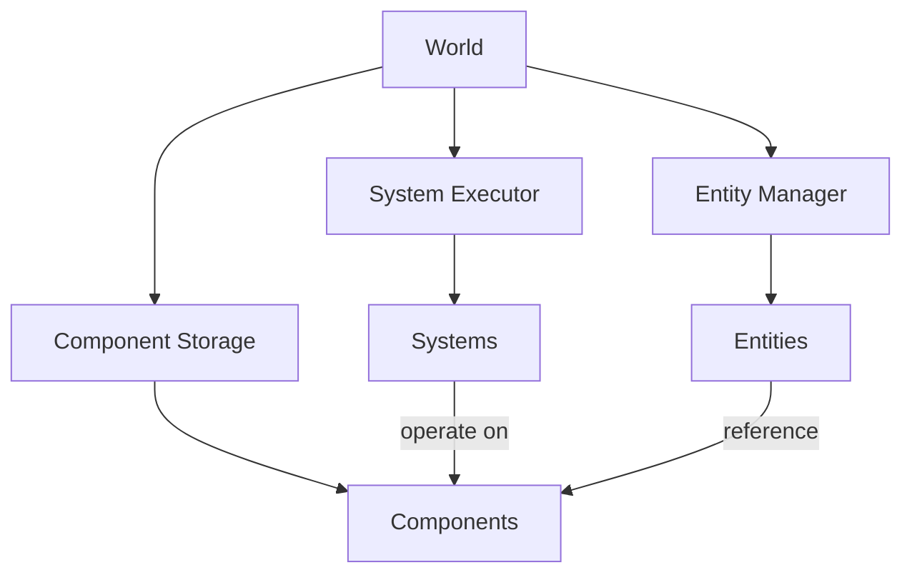
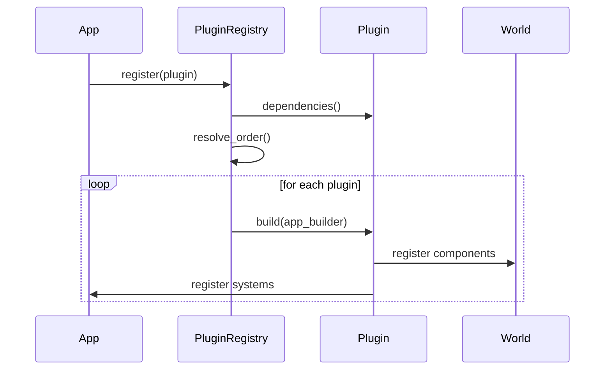
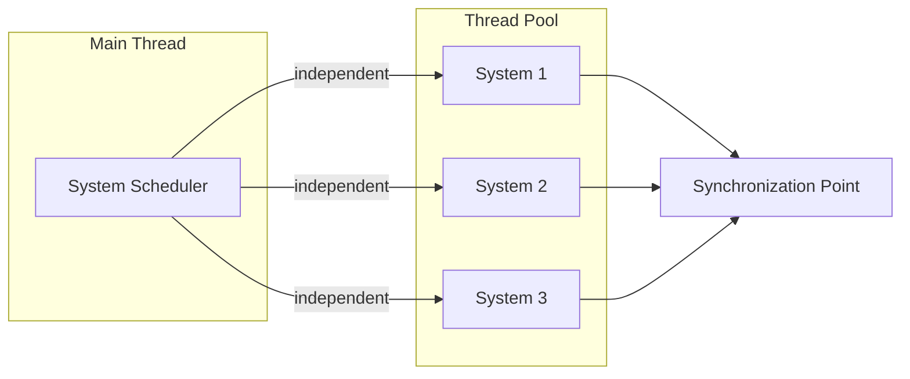

# Architecture

## Overview

The physics engine is built on a high-performance Entity Component System (ECS) architecture designed for cache-friendly data access patterns and parallel execution. This document outlines the core architectural decisions and extensibility mechanisms.

## Entity Component System (ECS)

### Design Philosophy

The ECS architecture separates data (components) from behavior (systems) and uses entities as lightweight identifiers. This approach provides:

- **Data-oriented design**: Components are stored in cache-friendly layouts
- **Decoupling**: Logic is separated from data, improving maintainability
- **Parallelization**: Systems can operate independently on disjoint component sets
- **Flexibility**: Easy to add new component types and systems without modifying existing code

### Core Concepts



#### Entities

Entities are unique identifiers (with generational indices) that tie together related components. They have:

- **Lightweight**: Just an ID and generation counter
- **Safe references**: Generational indices prevent use-after-free bugs
- **Efficient creation/destruction**: O(1) operations with ID reuse

#### Components

Components are pure data structures attached to entities:

- **Plain data**: No behavior, just state
- **Cache-friendly storage**: Future optimizations will use Structure-of-Arrays (SoA) layout
- **Type-safe**: Rust's type system ensures correctness
- **Trait-based**: Custom components implement the `Component` trait

#### Systems

Systems contain the logic that operates on entities with specific component combinations:

- **Stateless**: Systems operate on component data, not internal state
- **Composable**: Multiple systems can run independently
- **Parallelizable**: Systems with non-overlapping component access can run concurrently

### Current Implementation

The current implementation provides:

1. **Entity Management** (`entity.rs`)
   - Entity creation with generational indices
   - Safe entity lifecycle management
   - Entity validity checking

2. **Component Storage** (`component.rs`)
   - `Component` trait for all component types
   - `ComponentStorage` trait for storage implementations
   - `HashMapStorage` as initial implementation (to be optimized)

3. **System Execution** (`system.rs`)
   - `System` trait for logic implementation
   - `SystemExecutor` for managing system execution order
   - Hooks for parallel execution

4. **World Container** (`world.rs`)
   - Central ECS data container
   - Entity lifecycle management
   - Query interface foundation

### Future Optimizations

- **Structure-of-Arrays (SoA)**: Replace HashMap storage with packed arrays
- **Archetypes**: Group entities by component composition for better iteration
- **Query DSL**: Ergonomic component queries with filtering
- **System scheduling**: Automatic dependency analysis and parallel execution

## Plugin System

### Goals

The plugin system will enable:

- **Extensibility**: Third-party components and systems
- **Modularity**: Feature-gated subsystems (physics, rendering, audio)
- **Composition**: Plugins that depend on other plugins
- **Hot-reloading**: Dynamic plugin loading (future consideration)

### Plugin Interface (Planned)

```rust
pub trait Plugin {
    fn name(&self) -> &str;
    fn build(&self, app: &mut AppBuilder);
    fn dependencies(&self) -> Vec<&str> { vec![] }
}
```

### Plugin Registration Flow



### Plugin Examples

Future plugins might include:

- **PhysicsPlugin**: Rigid body dynamics, collision detection
- **RenderPlugin**: Graphics rendering systems
- **DiagnosticsPlugin**: Performance monitoring and profiling
- **NetworkPlugin**: Multiplayer synchronization

## Integration Methods

### Library Integration

The physics engine is designed as a Rust library crate that can be:

- **Embedded**: Directly included in Rust projects via Cargo
- **FFI**: Exposed to C/C++ through foreign function interface
- **WebAssembly**: Compiled to WASM for browser/web usage

### API Stability

- **Semantic versioning**: Breaking changes only in major versions
- **Feature flags**: Opt-in functionality without breaking changes
- **Deprecation warnings**: Gradual migration paths for API changes

### Example Integration

```rust
use physics_engine::prelude::*;

fn main() {
    let mut world = World::new();
    let mut executor = SystemExecutor::new();
    
    // Add custom systems
    executor.add_system(PhysicsSystem::new());
    executor.add_system(CollisionSystem::new());
    
    // Game loop
    loop {
        executor.run_parallel(&mut world);
    }
}
```

## Parallelization Strategy

### Rayon Integration

The engine uses Rayon for work-stealing parallelism:

- **Feature-gated**: Enable via `parallel` feature flag
- **Fallback support**: Graceful degradation to sequential execution
- **Platform compatibility**: Works on native and select WASM runtimes

### Parallel Execution Model



### Data Race Prevention

- **Disjoint component access**: Systems declare component requirements
- **Read/Write tracking**: Automatic conflict detection
- **Parallel scheduling**: Only independent systems run concurrently
- **Rust's borrow checker**: Compile-time safety guarantees

### Performance Considerations

- **Work granularity**: Systems should have sufficient work to amortize threading overhead
- **Cache locality**: Component storage optimized for sequential access
- **False sharing**: Padding to prevent cache line contention
- **SIMD opportunities**: Data layout supports vectorization

### Configuration

Parallelization can be controlled via:

```toml
[features]
default = ["parallel"]
parallel = ["dep:rayon"]
```

Disable for environments without thread support:

```bash
cargo build --no-default-features
```

### Future Enhancements

- **Job system**: Fine-grained parallelism within systems
- **GPU compute**: Offload to compute shaders for massive parallelism
- **Distributed execution**: Multi-machine physics simulation

## System Requirements

### Minimum Rust Version

- **MSRV**: Rust 1.70 or later
- **Edition**: 2021
- **Toolchain**: stable channel recommended

### Target Platforms

- **Primary**: Linux (x86_64, aarch64)
- **Secondary**: macOS, Windows
- **Experimental**: WebAssembly (with `--no-default-features`)

### Dependencies

Core dependencies (see `Cargo.toml` for exact versions):

- **rayon** (optional): Parallel execution via work-stealing
- Standard library only for core functionality

## Development Workflow

### Building

```bash
# Full build with all features
cargo build --release

# Without parallel support
cargo build --no-default-features

# Run tests
cargo test

# Run example
cargo run --example basic
```

### Documentation

```bash
# Generate and open documentation
cargo doc --open --all-features
```

### Benchmarking

```bash
# Run benchmarks (when available)
cargo bench
```

## References

- [ECS Pattern Overview](https://en.wikipedia.org/wiki/Entity_component_system)
- [Rayon Documentation](https://docs.rs/rayon)
- [Data-Oriented Design](https://www.dataorienteddesign.com/dodbook/)
