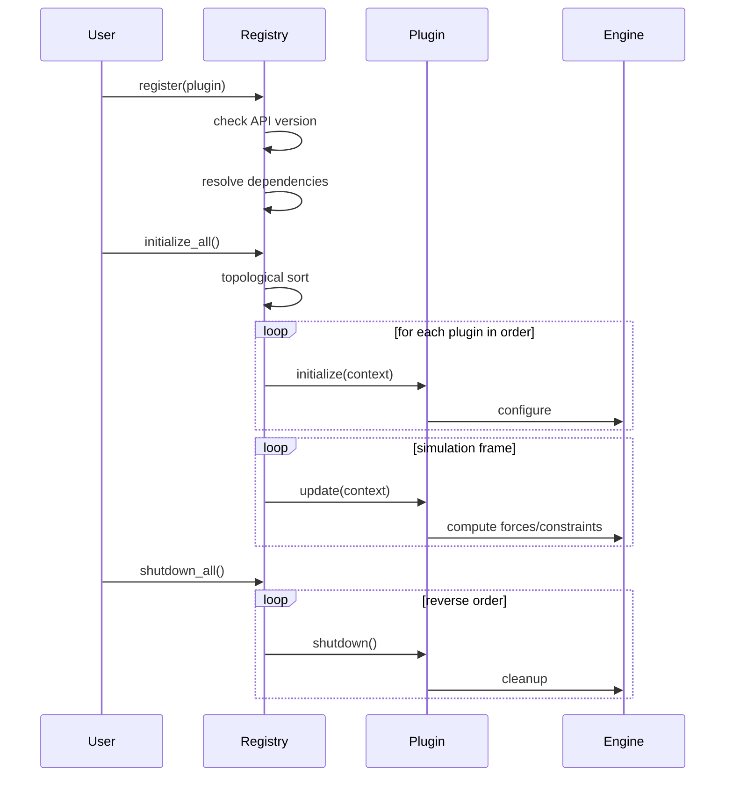
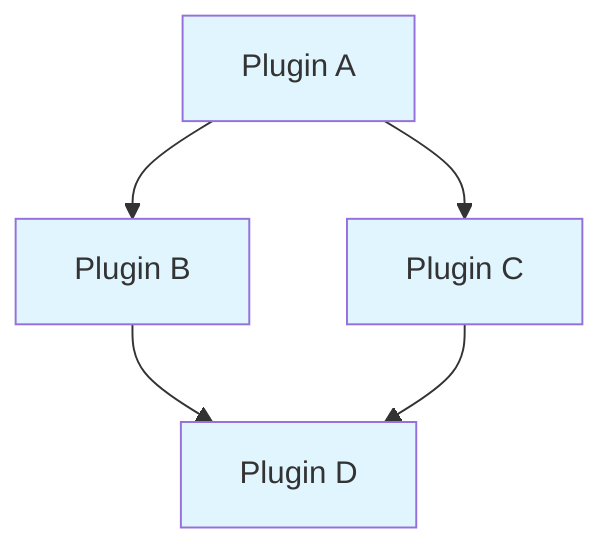

# Plugin System Guide

## Overview

The physics engine provides a comprehensive plugin system that enables users to extend functionality with custom objects, forces, and constraints without modifying the core engine code. This guide covers the plugin architecture, API usage, and best practices.

## Architecture

### Design Principles

The plugin system is built on these core principles:

1. **Safety**: Scoped access to engine internals with compile-time guarantees
2. **Extensibility**: Support for custom object types, forces, and constraints
3. **Modularity**: Plugin dependencies with automatic resolution
4. **Compatibility**: API versioning with semantic versioning checks
5. **Performance**: Zero-cost abstractions and optional parallelization

### Plugin Lifecycle



## Plugin Types

### 1. Object Factory Plugins

Object factories create entities with pre-configured components, enabling custom object types.

#### Interface

```rust
pub trait ObjectFactory: Plugin {
    fn create_object(&self, world: &mut World) -> Result<Entity, String>;
}
```

#### Example: Planet Factory

```rust
use physics_engine::plugins::{Plugin, ObjectFactory, PluginContext};
use physics_engine::ecs::{World, Entity, ComponentStorage, HashMapStorage};
use physics_engine::ecs::components::{Position, Velocity, Mass};
use std::any::Any;

struct PlanetFactory {
    default_mass: f64,
    default_radius: f64,
}

impl PlanetFactory {
    fn new(mass: f64, radius: f64) -> Self {
        PlanetFactory {
            default_mass: mass,
            default_radius: radius,
        }
    }
}

impl Plugin for PlanetFactory {
    fn name(&self) -> &str {
        "planet_factory"
    }

    fn version(&self) -> &str {
        "1.0.0"
    }

    fn as_any(&self) -> &dyn Any {
        self
    }

    fn as_any_mut(&mut self) -> &mut dyn Any {
        self
    }
}

impl ObjectFactory for PlanetFactory {
    fn create_object(&self, world: &mut World) -> Result<Entity, String> {
        let entity = world.create_entity();
        
        // Components would be added here in a real implementation
        // This is just a conceptual example
        
        Ok(entity)
    }
}
```

### 2. Force Provider Plugins

Force providers compute forces based on entity state, enabling gravity, springs, drag, and custom forces.

#### Interface

```rust
pub trait ForceProviderPlugin: Plugin + ForceProvider {
    fn as_force_provider(&self) -> &dyn ForceProvider;
}
```

#### Example: Gravity Plugin

```rust
use physics_engine::plugins::{Plugin, ForceProviderPlugin, PluginContext};
use physics_engine::ecs::Entity;
use physics_engine::ecs::systems::{Force, ForceRegistry, ForceProvider};
use std::any::Any;

struct GravityPlugin {
    acceleration: f64,  // gravitational acceleration (m/s²)
}

impl GravityPlugin {
    fn new(acceleration: f64) -> Self {
        GravityPlugin { acceleration }
    }
    
    /// Standard Earth gravity
    fn earth() -> Self {
        Self::new(-9.81)
    }
    
    /// Lunar gravity
    fn moon() -> Self {
        Self::new(-1.62)
    }
}

impl Plugin for GravityPlugin {
    fn name(&self) -> &str {
        "gravity"
    }

    fn version(&self) -> &str {
        "1.0.0"
    }

    fn initialize(&mut self, context: &PluginContext) -> Result<(), String> {
        eprintln!("Gravity plugin initialized with acceleration: {} m/s²", 
                  self.acceleration);
        Ok(())
    }

    fn as_any(&self) -> &dyn Any {
        self
    }

    fn as_any_mut(&mut self) -> &mut dyn Any {
        self
    }
}

impl ForceProvider for GravityPlugin {
    fn compute_force(&self, _entity: Entity, _registry: &ForceRegistry) -> Option<Force> {
        // In a real implementation, we'd get the mass from the entity
        // For this example, we'll return a constant force
        // Real implementation would: mass * gravity_acceleration
        Some(Force::new(0.0, self.acceleration, 0.0))
    }

    fn name(&self) -> &str {
        "gravity"
    }
}

impl ForceProviderPlugin for GravityPlugin {
    fn as_force_provider(&self) -> &dyn ForceProvider {
        self
    }
}
```

#### Example: Spring Force

```rust
use physics_engine::plugins::{Plugin, ForceProviderPlugin};
use physics_engine::ecs::Entity;
use physics_engine::ecs::systems::{Force, ForceRegistry, ForceProvider};
use std::any::Any;

struct SpringPlugin {
    entity_a: Entity,
    entity_b: Entity,
    rest_length: f64,
    stiffness: f64,
    damping: f64,
}

impl SpringPlugin {
    fn new(a: Entity, b: Entity, rest_length: f64, stiffness: f64) -> Self {
        SpringPlugin {
            entity_a: a,
            entity_b: b,
            rest_length,
            stiffness,
            damping: 0.1,
        }
    }
}

impl Plugin for SpringPlugin {
    fn name(&self) -> &str {
        "spring_force"
    }

    fn version(&self) -> &str {
        "1.0.0"
    }

    fn as_any(&self) -> &dyn Any {
        self
    }

    fn as_any_mut(&mut self) -> &mut dyn Any {
        self
    }
}

impl ForceProvider for SpringPlugin {
    fn compute_force(&self, entity: Entity, _registry: &ForceRegistry) -> Option<Force> {
        // In a real implementation:
        // 1. Check if entity is one of the spring endpoints
        // 2. Get positions of both entities
        // 3. Compute spring force: F = -k(|x| - rest_length) * direction
        // 4. Add damping: F_damping = -c * velocity
        
        if entity != self.entity_a && entity != self.entity_b {
            return None;
        }
        
        // Placeholder - real implementation would compute actual spring force
        Some(Force::zero())
    }

    fn name(&self) -> &str {
        "spring_force"
    }
}

impl ForceProviderPlugin for SpringPlugin {
    fn as_force_provider(&self) -> &dyn ForceProvider {
        self
    }
}
```

### 3. Constraint System Plugins

Constraint systems enforce geometric or physical constraints like joints, distance limits, and collision response.

#### Interface

```rust
pub trait ConstraintSystem: Plugin {
    fn apply_constraint(
        &mut self,
        positions: &mut dyn ComponentStorage<Component = Position>,
        velocities: &mut dyn ComponentStorage<Component = Velocity>,
        masses: &dyn ComponentStorage<Component = Mass>,
    ) -> Result<(), String>;
    
    fn priority(&self) -> i32 {
        100  // Default priority
    }
}
```

#### Example: Distance Constraint

```rust
use physics_engine::plugins::{Plugin, ConstraintSystem, PluginContext};
use physics_engine::ecs::{Entity, ComponentStorage};
use physics_engine::ecs::components::{Position, Velocity, Mass};
use std::any::Any;

struct DistanceConstraint {
    entity_a: Entity,
    entity_b: Entity,
    distance: f64,
    stiffness: f64,
}

impl DistanceConstraint {
    fn new(a: Entity, b: Entity, distance: f64) -> Self {
        DistanceConstraint {
            entity_a: a,
            entity_b: b,
            distance,
            stiffness: 1.0,
        }
    }
}

impl Plugin for DistanceConstraint {
    fn name(&self) -> &str {
        "distance_constraint"
    }

    fn version(&self) -> &str {
        "1.0.0"
    }

    fn as_any(&self) -> &dyn Any {
        self
    }

    fn as_any_mut(&mut self) -> &mut dyn Any {
        self
    }
}

impl ConstraintSystem for DistanceConstraint {
    fn apply_constraint(
        &mut self,
        positions: &mut dyn ComponentStorage<Component = Position>,
        _velocities: &mut dyn ComponentStorage<Component = Velocity>,
        _masses: &dyn ComponentStorage<Component = Mass>,
    ) -> Result<(), String> {
        // Get positions of both entities
        let pos_a = positions.get(self.entity_a)
            .ok_or("Entity A not found")?;
        let pos_b = positions.get(self.entity_b)
            .ok_or("Entity B not found")?;
        
        // Compute distance vector
        let dx = pos_b.x() - pos_a.x();
        let dy = pos_b.y() - pos_a.y();
        let dz = pos_b.z() - pos_a.z();
        let current_distance = (dx*dx + dy*dy + dz*dz).sqrt();
        
        if current_distance < 1e-10 {
            return Ok(()); // Entities at same position
        }
        
        // Compute correction
        let error = current_distance - self.distance;
        let correction = error * self.stiffness * 0.5;
        
        // Apply correction to both entities
        // (In real implementation, would respect mass ratios)
        let correction_x = (dx / current_distance) * correction;
        let correction_y = (dy / current_distance) * correction;
        let correction_z = (dz / current_distance) * correction;
        
        if let Some(pos_a_mut) = positions.get_mut(self.entity_a) {
            pos_a_mut.set_x(pos_a_mut.x() + correction_x);
            pos_a_mut.set_y(pos_a_mut.y() + correction_y);
            pos_a_mut.set_z(pos_a_mut.z() + correction_z);
        }
        
        if let Some(pos_b_mut) = positions.get_mut(self.entity_b) {
            pos_b_mut.set_x(pos_b_mut.x() - correction_x);
            pos_b_mut.set_y(pos_b_mut.y() - correction_y);
            pos_b_mut.set_z(pos_b_mut.z() - correction_z);
        }
        
        Ok(())
    }

    fn priority(&self) -> i32 {
        10  // Run before other constraints
    }
}
```

## Plugin Registration

### Static Registration

Recommended for most use cases - zero runtime overhead:

```rust
use physics_engine::plugins::PluginRegistry;

fn main() {
    let mut registry = PluginRegistry::new();
    
    // Method 1: Direct registration
    registry.register(Box::new(GravityPlugin::earth()))
        .expect("Failed to register gravity plugin");
    
    // Method 2: Using the macro
    register_plugin!(registry, SpringPlugin::new(entity_a, entity_b, 1.0, 100.0));
}
```

### Plugin Discovery

The registry supports plugin discovery via the `PHYSICS_ENGINE_PLUGIN_PATH` environment variable:

```bash
export PHYSICS_ENGINE_PLUGIN_PATH=/usr/local/lib/physics-plugins:/home/user/plugins
```

**Note**: Dynamic plugin loading is not currently implemented to maintain compatibility with stable Rust and avoid unsafe code. The environment variable is parsed but no dynamic loading occurs.

## Dependency Management

### Declaring Dependencies

Plugins can depend on other plugins:

```rust
impl Plugin for MyPlugin {
    fn dependencies(&self) -> Vec<&str> {
        vec!["base_physics", "collision_detection"]
    }
}
```

### Dependency Resolution

The registry automatically:

1. **Validates** all dependencies are registered
2. **Sorts** plugins topologically by dependencies
3. **Detects** circular dependencies and rejects them
4. **Initializes** plugins in dependency order



**Load Order**: D → B → C → A

### Circular Dependency Detection

```rust
// This will be rejected:
// Plugin A depends on C
// Plugin B depends on A  
// Plugin C depends on B
// Forms cycle: A → C → B → A

let mut registry = PluginRegistry::new();
registry.register(Box::new(PluginA)).unwrap();
registry.register(Box::new(PluginB)).unwrap();
registry.register(Box::new(PluginC)).unwrap();

let result = registry.initialize_all(&context);
assert!(result.is_err());
assert!(result.unwrap_err().contains("Circular dependency"));
```

## Version Compatibility

### API Versioning

The plugin API uses semantic versioning:

- **Major version** (X.0.0): Breaking API changes
- **Minor version** (0.X.0): Backward-compatible additions
- **Patch version** (0.0.X): Bug fixes only

### Version Checking

```rust
impl Plugin for MyPlugin {
    fn api_version(&self) -> &str {
        physics_engine::plugins::PLUGIN_API_VERSION
    }
}
```

**Compatibility Rules**:
- Plugin major version must match engine major version
- Plugin minor version must be ≤ engine minor version
- Patch versions are ignored for compatibility

**Examples**:
- ✅ Plugin 0.1.0 with Engine 0.1.0 - Compatible
- ✅ Plugin 0.1.5 with Engine 0.2.0 - Compatible (minor upgrade)
- ❌ Plugin 0.2.0 with Engine 0.1.0 - Incompatible (plugin too new)
- ❌ Plugin 1.0.0 with Engine 0.1.0 - Incompatible (major mismatch)

## Plugin Context

### Available Information

The `PluginContext` provides scoped access to engine state:

```rust
pub struct PluginContext<'a> {
    // Immutable world reference
    world: &'a World,
    
    // Active integrator name
    integrator_name: &'a str,
    
    // Current timestep
    timestep: f64,
    
    // Thread pool handle (if parallel feature enabled)
    #[cfg(feature = "parallel")]
    thread_pool: Option<&'a ThreadPool>,
}
```

### Using the Context

```rust
impl Plugin for MyPlugin {
    fn initialize(&mut self, context: &PluginContext) -> Result<(), String> {
        eprintln!("Initializing with integrator: {}", context.integrator_name());
        eprintln!("Timestep: {} seconds", context.timestep());
        eprintln!("Threads available: {}", context.thread_count());
        
        if context.is_parallel_enabled() {
            eprintln!("Parallel execution enabled");
        }
        
        Ok(())
    }
}
```

## Safety and Best Practices

### API Boundaries

✅ **Safe Operations**:
- Read immutable world state via `PluginContext`
- Type-checked component access at compile time
- Bounded force magnitudes with validation
- Thread-safe trait requirements (Send + Sync)

❌ **Prohibited Operations**:
- Storing references to world or components
- Creating threads manually (use provided thread pool)
- Mutating forbidden components
- Unsafe memory operations

### Error Handling

Return descriptive errors from plugin methods:

```rust
impl ObjectFactory for MyFactory {
    fn create_object(&self, world: &mut World) -> Result<Entity, String> {
        if !self.validate_config() {
            return Err("Invalid factory configuration: missing required parameter".to_string());
        }
        
        let entity = world.create_entity();
        // ... setup components
        
        Ok(entity)
    }
}
```

### Performance Tips

1. **Cache expensive calculations**:
```rust
struct MyPlugin {
    cached_value: f64,
    cache_valid: bool,
}

impl Plugin for MyPlugin {
    fn update(&mut self, context: &PluginContext) -> Result<(), String> {
        if !self.cache_valid {
            self.cached_value = expensive_calculation();
            self.cache_valid = true;
        }
        Ok(())
    }
}
```

2. **Use inline for hot paths**:
```rust
impl ForceProvider for MyPlugin {
    #[inline]
    fn compute_force(&self, entity: Entity, registry: &ForceRegistry) -> Option<Force> {
        // Frequently called method
        Some(Force::new(0.0, -9.81, 0.0))
    }
}
```

3. **Minimize allocations**:
```rust
// ❌ Bad: Allocates every frame and doesn't compile (Force doesn't implement Sum)
fn compute_force(&self, ...) -> Option<Force> {
    // This doesn't work because Force doesn't implement Sum
    // let forces = vec![Force::new(1.0, 0.0, 0.0), ...];
    // Some(forces.iter().sum())
    
    // Use manual accumulation instead:
    let mut total = Force::zero();
    total.add(&Force::new(1.0, 0.0, 0.0));
    total.add(&Force::new(0.0, 2.0, 0.0));
    Some(total)
}

// ✅ Good: No allocations, correct usage
fn compute_force(&self, ...) -> Option<Force> {
    let mut total = Force::zero();
    total.add(&Force::new(1.0, 0.0, 0.0));
    total.add(&Force::new(0.0, 2.0, 0.0));
    Some(total)
}
```

## Complete Example

Here's a complete example showing plugin registration and usage:

```rust
use physics_engine::ecs::World;
use physics_engine::plugins::{PluginRegistry, PluginContext};

fn main() -> Result<(), String> {
    // Create world and registry
    let mut world = World::new();
    let mut registry = PluginRegistry::new();
    
    // Register plugins
    registry.register(Box::new(GravityPlugin::earth()))?;
    registry.register(Box::new(SpringPlugin::new(e1, e2, 1.0, 100.0)))?;
    
    // Try to discover additional plugins from environment
    let discovered = registry.discover_plugins()?;
    eprintln!("Discovered {} plugins from environment", discovered);
    
    // Initialize all plugins
    let integrator_name = "verlet";
    let timestep = 0.016; // 60 FPS
    
    #[cfg(feature = "parallel")]
    let context = PluginContext::new(&world, integrator_name, timestep, None);
    #[cfg(not(feature = "parallel"))]
    let context = PluginContext::new(&world, integrator_name, timestep);
    
    registry.initialize_all(&context)?;
    
    // Main simulation loop
    for _frame in 0..1000 {
        // Update plugins
        registry.update_all(&context)?;
        
        // Run physics simulation
        // ... simulation code
    }
    
    // Cleanup
    registry.shutdown_all()?;
    
    Ok(())
}
```

## Environment Configuration

See `.env.example` for environment variable configuration:

```bash
# Path to search for plugin libraries (colon-separated on Unix, semicolon on Windows)
# Currently informational only - dynamic loading not implemented
PHYSICS_ENGINE_PLUGIN_PATH=/usr/local/lib/physics-plugins:/home/user/custom-plugins
```

## Troubleshooting

### Plugin Registration Fails

**Problem**: `Plugin 'X' is already registered`

**Solution**: Each plugin must have a unique name. Check `name()` method returns a unique string.

### Initialization Fails

**Problem**: `Plugin 'X' depends on 'Y' which is not registered`

**Solution**: Register all plugin dependencies before calling `initialize_all()`.

### Circular Dependency Error

**Problem**: `Circular dependency detected in plugin dependencies`

**Solution**: Review plugin dependencies and break the cycle. Use plugin initialization to configure cross-plugin communication instead of hard dependencies.

### Version Mismatch

**Problem**: `Plugin 'X' API version 0.2.0 is incompatible with engine API version 0.1.0`

**Solution**: Update the plugin to match the engine API version, or update the engine to support the plugin version.

## Built-in Plugins

### Gravitational N-Body Plugin

The engine includes a high-performance gravitational force plugin that implements Newton's law of universal gravitation.

#### Features

- **Realistic Physics**: Uses the standard gravitational constant (G = 6.67430 × 10⁻¹¹ m³/(kg⋅s²))
- **Softening Factor**: Prevents singularities when particles are very close
- **Parallel Computation**: Efficient O(N²) pairwise force calculation using Rayon
- **Configurable**: Adjustable G constant, softening, and chunk sizes
- **Validated**: Comprehensive test suite with reference calculations

#### Usage Example

```rust
use physics_engine::ecs::{World, Entity, ComponentStorage, HashMapStorage};
use physics_engine::ecs::components::{Position, Velocity, Mass, Acceleration};
use physics_engine::ecs::systems::{ForceRegistry, apply_forces_to_acceleration};
use physics_engine::integration::VelocityVerletIntegrator;
use physics_engine::plugins::gravity::{
    GravityPlugin, GravitySystem, GRAVITATIONAL_CONSTANT
};

fn main() {
    // Create world and entities
    let mut world = World::new();
    let earth = world.create_entity();
    let moon = world.create_entity();

    // Setup component storage
    let mut positions = HashMapStorage::<Position>::new();
    let mut velocities = HashMapStorage::<Velocity>::new();
    let mut masses = HashMapStorage::<Mass>::new();
    let mut accelerations = HashMapStorage::<Acceleration>::new();

    // Earth at origin
    positions.insert(earth, Position::new(0.0, 0.0, 0.0));
    velocities.insert(earth, Velocity::zero());
    masses.insert(earth, Mass::new(5.972e24)); // kg
    accelerations.insert(earth, Acceleration::zero());

    // Moon at ~384,400 km distance
    positions.insert(moon, Position::new(3.844e8, 0.0, 0.0));
    velocities.insert(moon, Velocity::new(0.0, 1022.0, 0.0)); // m/s
    masses.insert(moon, Mass::new(7.342e22)); // kg
    accelerations.insert(moon, Acceleration::zero());

    // Create gravity system
    let gravity_plugin = GravityPlugin::new(GRAVITATIONAL_CONSTANT);
    let gravity_system = GravitySystem::new(gravity_plugin);

    // Create force registry and integrator
    let mut force_registry = ForceRegistry::new();
    force_registry.max_force_magnitude = 1e25; // Increase limit for large forces
    let mut integrator = VelocityVerletIntegrator::new(3600.0); // 1 hour timestep

    // Simulation loop
    let entities = vec![earth, moon];
    for _step in 0..1000 {
        // Compute gravitational forces
        gravity_system.compute_forces(&entities, &positions, &masses, &mut force_registry);

        // Apply forces → accelerations
        apply_forces_to_acceleration(
            entities.iter(),
            &force_registry,
            &masses,
            &mut accelerations,
            false,
        );

        // Integrate motion
        integrator.integrate(
            entities.iter(),
            &mut positions,
            &mut velocities,
            &accelerations,
            &masses,
            &mut force_registry,
            false,
        );

        // Clear forces for next step
        force_registry.clear_forces();
    }
}
```

#### Configuration Options

**Creating a Gravity Plugin**:

```rust
// Standard gravitational constant
let gravity = GravityPlugin::new(GRAVITATIONAL_CONSTANT);

// Scaled G for demonstrations (stronger/weaker gravity)
let gravity_strong = GravityPlugin::with_scaled_g(1e10); // 10^21 × G

// Default settings
let gravity_default = GravityPlugin::default_settings();
```

**Setting Softening**:

```rust
let mut gravity = GravityPlugin::new(GRAVITATIONAL_CONSTANT);

// No softening (can cause singularities!)
gravity.set_softening(0.0);

// Small softening for solar system (1 km)
gravity.set_softening(1e3);

// Large softening for particle clouds (100 m)
gravity.set_softening(100.0);
```

**Parallel Performance Tuning**:

```rust
let mut gravity = GravityPlugin::new(GRAVITATIONAL_CONSTANT);

// Automatic chunk sizing (recommended)
gravity.set_chunk_size(0);

// Manual chunk size (advanced)
gravity.set_chunk_size(64); // Process 64 entities per chunk
```

#### Physics Background

The plugin implements Newton's law of universal gravitation:

**F = G × (m₁ × m₂) / r²**

With softening to prevent singularities:

**F = G × (m₁ × m₂) / (r² + ε²)**

Where:
- **F**: Gravitational force (Newtons)
- **G**: Gravitational constant (6.67430 × 10⁻¹¹ m³/(kg⋅s²))
- **m₁, m₂**: Masses of the two bodies (kg)
- **r**: Distance between centers of mass (m)
- **ε**: Softening length (m)

#### Performance Characteristics

- **Complexity**: O(N²) for N bodies (all pairwise interactions)
- **Parallelization**: Chunk-based parallel processing with Rayon
- **Memory**: O(N) for force accumulation
- **Typical Performance**:
  - N=10 (solar system): microseconds per step
  - N=100 (particle cloud): milliseconds per step
  - N=1000 (large N-body): ~0.5-1 second per step

For N > 1000, consider:
- Barnes-Hut tree (O(N log N))
- Fast Multipole Method (O(N))
- GPU acceleration

#### Edge Cases and Validation

The plugin handles:

✅ **Zero distance**: Softening prevents division by zero  
✅ **Immovable bodies**: Bodies with zero/tiny mass don't experience forces  
✅ **Negative masses**: Rejected with assertion during construction  
✅ **NaN/Infinity**: Detected and reported as invalid forces  
✅ **Large forces**: Configurable force magnitude limits in ForceRegistry

#### Examples

See complete working examples in:
- [`examples/solar_system.rs`](../physics-engine/examples/solar_system.rs): Realistic solar system simulation
- [`examples/particle_collision.rs`](../physics-engine/examples/particle_collision.rs): N-body particle dynamics

Run with:
```bash
cargo run --example solar_system --release
cargo run --example particle_collision --release -- --particles 200
```

#### References

**Physics**:
- Newton, I. (1687). *Philosophiæ Naturalis Principia Mathematica*
- [CODATA 2018 Gravitational Constant](https://physics.nist.gov/cgi-bin/cuu/Value?bg)
- Goldstein, H., et al. (2002). *Classical Mechanics* (3rd ed.)

**Numerical Methods**:
- Dehnen, W. (2001). "Towards optimal softening in three-dimensional N-body codes"
- Aarseth, S. J. (2003). *Gravitational N-Body Simulations*

## Future Enhancements

Planned features for future versions:

- **Dynamic loading**: Load plugins from shared libraries at runtime
- **Hot reloading**: Reload plugins without restarting the engine
- **Plugin marketplace**: Repository of community plugins
- **Configuration files**: Load plugin settings from TOML/JSON
- **Debugging tools**: Plugin introspection and profiling
- **More built-in plugins**: Springs, damping, collision response, constraints

## References

- [API Documentation](../README.md#plugin-architecture)
- [Architecture Guide](architecture.md)
- [Examples Guide](examples.md)
- [Integration Guide](integration.md)
