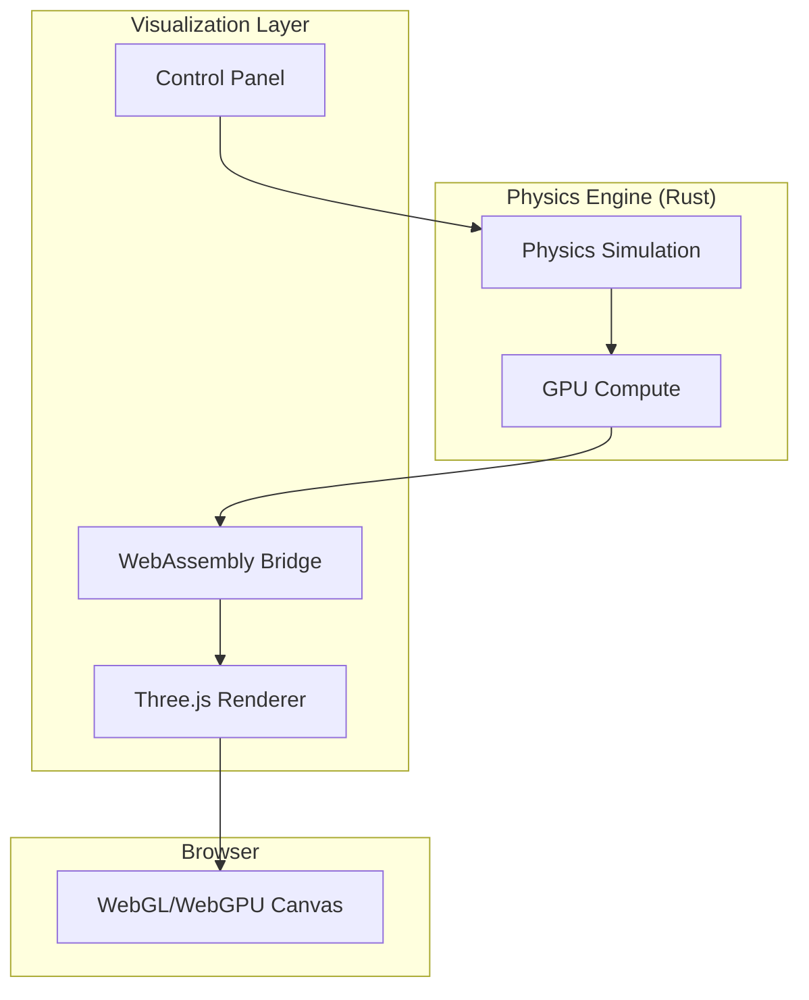

# Project Roadmap

## Overview

This document outlines the planned features, enhancements, and long-term vision for the physics engine. It covers near-term improvements, GPU acceleration strategies, advanced integration methods, collision systems, constraints, and visualization integration.

## Project Vision

**Mission**: Build a high-performance, extensible physics simulation engine that balances ease of use with computational efficiency, suitable for games, scientific visualization, and educational purposes.

**Core Values**:
- **Performance**: Optimize for modern hardware (multi-core CPUs, GPUs)
- **Correctness**: Accurate physics with well-tested numerical methods
- **Ergonomics**: Clean API that's easy to learn and use
- **Extensibility**: Plugin system for custom physics and constraints
- **Portability**: Target desktop, web (WebAssembly), and eventually mobile

## Version 0.1.0 - Foundation (Completed)

✅ **Released**: Initial ECS-based physics engine

**Completed Features** (ISS-1 through ISS-5):
- [x] Entity Component System (ECS) core architecture
- [x] Newtonian physics components (Position, Velocity, Acceleration, Mass)
- [x] Staged system scheduler with parallel execution support
- [x] Force accumulation and provider system
- [x] Velocity Verlet integrator (symplectic, 2nd-order accurate)
- [x] RK4 integrator (4th-order accurate)
- [x] Plugin system with dependency resolution
- [x] Gravitational N-body plugin with realistic physics
- [x] Comprehensive documentation (architecture, integration, plugins, examples)
- [x] Example programs (basic ECS, solar system, particle collision)
- [x] Benchmark suite comparing integrators
- [x] Conservation tests validating accuracy

**Deliverables**:
- Core library crate with ECS and integration
- Plugin API for extensibility
- Working examples demonstrating features
- Documentation suite covering architecture and usage

## Version 0.2.0 - Performance & Memory (Planned)

**Target**: Q1-Q2 2025 (aspirational)

**Focus**: Memory layout optimization and cache efficiency improvements

### High Priority

#### Structure-of-Arrays (SoA) Component Storage
**Goal**: Replace HashMap storage with cache-friendly SoA layout

**Benefits**:
- 2-4× integration speedup via cache locality
- Enable SIMD vectorization (AVX2/AVX-512)
- Reduced memory bandwidth requirements

**Implementation**:
```rust
// Current: Array-of-Structures (AoS)
HashMap<Entity, Position>  // Position { x, y, z }

// Planned: Structure-of-Arrays (SoA)
struct PositionStorage {
    x: Vec<f64>,  // All x coordinates contiguous
    y: Vec<f64>,
    z: Vec<f64>,
    entity_indices: Vec<Entity>,
}
```

**Challenges**:
- Migration path for existing code
- Sparse entity support (deleted entities)
- API ergonomics trade-offs

#### SIMD Vectorization
**Goal**: Leverage CPU vector instructions for parallel computation

**Scope**:
- Vectorize position/velocity updates
- Vectorize force accumulation
- Support AVX2 (4× f64) and AVX-512 (8× f64)

**Expected Speedup**: 2-4× on modern CPUs

**Dependencies**:
- Requires SoA layout
- Alignment constraints (32-byte for AVX2)
- Platform detection and fallbacks

#### Memory Pooling
**Goal**: Reduce allocation overhead for temporary buffers

**Approach**:
- Pre-allocate entity storage pools
- Reuse integration working memory
- Custom allocators for hot paths

**Expected Impact**: 10-20% reduction in frame time

### Medium Priority

#### Adaptive Chunk Sizing for Parallel Execution
**Goal**: Automatically tune work distribution for optimal parallel performance

**Current**: Fixed chunk sizes or default Rayon splitting

**Planned**: Profile-guided chunk sizing based on:
- Entity count
- Available threads
- Cache size
- Force complexity

#### Query DSL for Component Access
**Goal**: Ergonomic and efficient entity queries

**Example**:
```rust
world.query::<(&Position, &mut Velocity, &Mass)>()
    .filter(|e| e.has::<Active>())
    .for_each(|(pos, vel, mass)| {
        // Process entities
    });
```

**Benefits**:
- Type-safe compile-time checking
- Automatic parallelization
- Clear dependency tracking

## Version 0.3.0 - Spatial Acceleration (Planned)

**Target**: Q2-Q3 2025 (aspirational)

**Focus**: Scalability for large particle counts

### High Priority

#### Barnes-Hut Tree for Gravity
**Goal**: O(N log N) gravitational force computation

**Algorithm**:
- Hierarchical octree subdivision
- Approximate distant particles as single mass
- Configurable accuracy threshold (θ parameter)

**Expected Impact**: 10-100× speedup for N > 1000 particles

**Use Cases**:
- Large N-body simulations
- Galaxy formation
- Particle swarms

**Implementation Notes**:
- Tree construction: O(N log N)
- Force evaluation: O(N log N)
- Parallel tree traversal challenges

#### Octree Spatial Partitioning
**Goal**: General-purpose spatial acceleration structure

**Use Cases**:
- Fast collision detection (O(log N) per query)
- Spatial queries (nearest neighbor, radius search)
- Level-of-detail selection
- Frustum culling for rendering

**Features**:
- Dynamic insertion/removal
- Configurable subdivision criteria
- Parallel construction

### Medium Priority

#### Broad-Phase Collision Detection
**Goal**: Quickly identify potential collision pairs

**Methods Under Consideration**:
- **Sweep and Prune** (SAP): Sort along axes, detect overlaps
- **Spatial Hashing**: Grid-based bucketing
- **Bounding Volume Hierarchies** (BVH): Tree of bounding boxes

**Trade-offs**:
| Method | Construction | Query | Dynamic Updates | Memory |
|--------|--------------|-------|-----------------|--------|
| SAP    | O(N log N)   | O(N)  | Fast            | Low    |
| Spatial Hash | O(N)  | O(1) avg | Instant        | Medium |
| BVH    | O(N log N)   | O(log N) | Slow        | High   |

**Decision**: Likely start with spatial hashing for simplicity, add BVH later for complex scenes.

## Version 0.4.0 - Collision & Constraints (Planned)

**Target**: Q3-Q4 2025 (aspirational)

**Focus**: Contact resolution and constraint systems

### High Priority

#### Narrow-Phase Collision Detection
**Goal**: Precise collision detection between shapes

**Supported Primitives**:
- Sphere-sphere (simple, fast)
- Box-box (SAT or GJK)
- Sphere-box (hybrid approach)
- Convex polyhedra (GJK/EPA)

**Output**: Contact points, normals, penetration depths

#### Impulse-Based Collision Response
**Goal**: Realistic collision resolution

**Algorithm**: Sequential impulse method
- Compute collision impulses from contact constraints
- Apply impulses to velocities
- Support friction and restitution coefficients

**Features**:
- Configurable elasticity (0 = inelastic, 1 = elastic)
- Friction modeling (static and kinetic)
- Contact point caching for stability

#### Joint Constraints
**Goal**: Connect entities with mechanical joints

**Joint Types**:
- **Ball-and-socket**: Point-to-point connection (3 DOF)
- **Hinge**: Revolute joint (1 DOF rotation)
- **Slider**: Prismatic joint (1 DOF translation)
- **Fixed**: Weld two bodies together (0 DOF)

**Solver**: Iterative constraint solver (PGS or similar)

### Medium Priority

#### Distance Constraints
**Goal**: Maintain fixed distances between entities

**Use Cases**:
- Rope simulation
- Cloth pinning
- Rigid body clustering

**Algorithm**: XPBD (Extended Position Based Dynamics) or Gauss-Seidel

#### SHAKE/RATTLE Algorithms
**Goal**: Preserve geometric constraints during integration

**SHAKE**: Position constraint projection
**RATTLE**: Velocity constraint projection (extension of SHAKE)

**Use Cases**:
- Rigid body constraints
- Fixed bond lengths in molecular dynamics
- Holonomic constraints

## Version 0.5.0 - GPU Acceleration (Planned)

**Target**: Q4 2025 - Q1 2026 (aspirational)

**Focus**: Massively parallel computation on GPUs

### GPU Backend Strategy

**Primary Options**:

#### Option 1: CUDA (NVIDIA-specific)
**Pros**:
- ✅ Mature ecosystem with extensive documentation
- ✅ Excellent performance on NVIDIA GPUs
- ✅ Large body of existing physics code to reference
- ✅ Comprehensive debugging and profiling tools

**Cons**:
- ❌ NVIDIA-only (excludes AMD, Intel, Mac)
- ❌ Requires CUDA SDK installation
- ❌ Not available in WebAssembly

**Best For**: Research, scientific computing, data centers with NVIDIA GPUs

#### Option 2: WebGPU Compute Shaders (Multi-platform)
**Pros**:
- ✅ Cross-platform (Windows, Linux, macOS, eventually Web)
- ✅ Works on NVIDIA, AMD, Intel, Apple GPUs
- ✅ Standard API (based on WebGPU spec)
- ✅ Rust support via `wgpu` crate
- ✅ Path to browser-based simulation

**Cons**:
- ❌ Less mature than CUDA
- ❌ May have performance gap vs CUDA on NVIDIA hardware
- ❌ Debugging tools less developed

**Best For**: Cross-platform applications, games, web integration

#### Option 3: Hybrid Approach
**Strategy**: Support both CUDA and WebGPU via abstraction layer

```rust
pub trait GpuBackend {
    fn allocate_buffer(&mut self, size: usize) -> BufferId;
    fn compute_forces(&mut self, positions: &[f64], masses: &[f64]) -> Vec<Force>;
    fn integrate(&mut self, dt: f64, positions: &mut [f64], velocities: &mut [f64]);
}

// Implementations:
// - CudaBackend (NVIDIA)
// - WebGpuBackend (cross-platform)
// - CpuBackend (fallback)
```

**Decision Criteria**:
- **Research use case**: CUDA for maximum performance
- **General use case**: WebGPU for portability
- **Library goal**: Likely prioritize WebGPU, add CUDA if demand exists

### GPU Implementation Plan

#### Phase 1: Force Computation on GPU
**Goal**: Offload O(N²) pairwise force calculations

**Algorithm**:
```
For each particle i (parallel):
    force_i = sum over j≠i of force(i, j)
```

**Challenges**:
- Memory transfer overhead (CPU ↔ GPU)
- Divergent execution for conditionals
- Atomic operations for force accumulation
- Load balancing for uneven distributions

**Expected Speedup**: 10-100× for N > 1000

#### Phase 2: Integration on GPU
**Goal**: Keep entire simulation on GPU

**Benefits**:
- Eliminate CPU-GPU transfer bottleneck
- Enables larger timesteps with faster computation
- Sustained performance for large N

**Challenges**:
- Complex integrators (RK4) require more GPU memory
- Constraint solvers are harder to parallelize
- Debugging on GPU is more difficult

#### Phase 3: Hybrid CPU/GPU Execution
**Goal**: Automatically partition work between CPU and GPU

**Heuristics**:
- N < 100: CPU only (GPU overhead not worth it)
- 100 < N < 500: Hybrid (forces on GPU, constraints on CPU)
- N > 500: GPU dominant

**Framework**: Similar to heterogeneous computing in HPC

### GPU Feature Roadmap

- [ ] WebGPU compute shader framework integration (`wgpu`)
- [ ] GPU buffer management and transfer optimization
- [ ] Parallel force computation kernel (gravity, springs)
- [ ] GPU integration kernels (Verlet, RK4)
- [ ] Bandwidth optimization (minimize CPU-GPU transfers)
- [ ] Hybrid CPU/GPU workload distribution
- [ ] Optional CUDA backend for NVIDIA-specific optimizations

### Platform-Specific Considerations

**Desktop** (Windows, Linux, macOS):
- ✅ Full GPU access via WebGPU or CUDA
- ✅ Large GPU memory (GB range)
- ✅ High bandwidth interconnects

**Web** (WebAssembly + WebGPU):
- ⚠️ WebGPU support varies by browser
- ⚠️ Memory limits more restrictive
- ⚠️ Shader compilation may be slower
- ✅ Still provides massive speedup vs CPU-only

**Mobile** (Future):
- ⚠️ GPU capabilities vary widely
- ⚠️ Power consumption concerns
- ⚠️ Thermal throttling
- ✅ Modern mobile GPUs quite capable for moderate N

## Version 0.6.0 - Visualization Integration (Planned)

**Target**: Q1-Q2 2026 (aspirational)

**Focus**: Real-time visualization and debugging tools

### WebGPU + Three.js Visualizer

**Architecture**:



**Components**:

#### 1. Rust-WASM Bridge
**Responsibilities**:
- Compile physics engine to WebAssembly
- Expose API for JavaScript integration
- Efficient binary data transfer (SharedArrayBuffer when available)
- Handle threading constraints in WASM

**Technologies**:
- `wasm-bindgen` for Rust-JS interop
- `wasm-pack` for build tooling
- `web-sys` for DOM access

#### 2. Three.js Rendering
**Responsibilities**:
- Real-time 3D rendering of simulation
- Camera controls and scene navigation
- Lighting and materials for visual quality
- Particle systems and instanced rendering

**Features**:
- ✅ Sphere/box rendering for particles
- ✅ Trail rendering for orbits
- ✅ Glow effects for stars
- ✅ Skybox/background
- ✅ Dynamic lighting
- ✅ Shadow mapping (optional)

#### 3. Interactive Controls
**Responsibilities**:
- Simulation parameters (timestep, gravity, integrator)
- Camera controls (orbit, pan, zoom)
- Entity selection and inspection
- Play/pause/step controls
- Recording and replay

**UI Framework Options**:
- **React**: Full-featured, large ecosystem
- **Svelte**: Lightweight, good performance
- **Vanilla JS**: Minimal dependencies

**Decision**: Likely Svelte for balance of features and size

### Desktop Visualization (Optional)

**Alternative**: Native desktop visualization using:
- **Bevy**: Rust game engine with ECS integration
- **wgpu**: Cross-platform graphics API
- **egui**: Immediate-mode GUI for controls

**Advantages**:
- Better performance than browser
- No WASM compilation step
- Full GPU access

**Disadvantages**:
- Requires native installation
- Platform-specific builds
- Less accessible than web version

**Decision**: Web version is priority, desktop visualization as optional alternative

### Debugging and Profiling Tools

**Planned Features**:
- Real-time performance graphs (frame time, entity count)
- Energy conservation monitoring
- Force vector visualization
- Constraint violation highlighting
- Breakpoints on entity collision
- State recording and replay

### Example Use Cases

**Educational**:
- Interactive solar system with planet selection
- Particle collision demonstrations
- Constraint system experiments

**Gamedev**:
- Physics sandbox for prototyping
- Debug visualization for game physics
- Parameter tuning interface

**Research**:
- N-body simulation visualization
- Algorithm comparison tool
- Publication-quality renders

## Version 1.0.0 - Stable Release (Long-term)

**Target**: 2026 (aspirational)

**Criteria for 1.0**:
- [ ] Stable, well-tested API
- [ ] Comprehensive documentation
- [ ] Multiple backend support (CPU, GPU)
- [ ] Production-ready performance
- [ ] Active community and ecosystem
- [ ] Semantic versioning commitment
- [ ] Long-term support plan

## Advanced Features (Future Exploration)

### Soft Body Physics
**Complexity**: High
**Use Cases**: Cloth, deformable objects, fluid simulation (particles)

**Approaches**:
- Mass-spring systems
- Position-based dynamics (PBD)
- Finite element methods (FEM)

**Challenges**: Stability, stiffness, computational cost

### Fluid Simulation
**Complexity**: Very High
**Use Cases**: Water, smoke, gas dynamics

**Methods**:
- Smoothed Particle Hydrodynamics (SPH)
- Lattice Boltzmann Method (LBM)
- Navier-Stokes solvers

**Challenges**: Incompressibility, boundary conditions, visual plausibility

### Fracture and Destruction
**Complexity**: High
**Use Cases**: Breaking objects, terrain deformation

**Approaches**:
- Voronoi fracture patterns
- Progressive damage models
- Particle emission on fracture

**Challenges**: Real-time performance, visual quality, stability

### Haptic Feedback Integration
**Complexity**: Medium
**Use Cases**: VR/AR, surgical simulation, robotics

**Requirements**:
- Very high update rates (1kHz+)
- Low latency
- Stable force feedback

## Technology Dependencies

### Core Dependencies (Current)
- **rayon**: Parallel execution (v1.10.0)
- **semver**: Version checking (v1.0.23)

### Planned Dependencies

**Memory & Performance**:
- **`packed_simd`** or **`portable-simd`**: SIMD intrinsics (when SoA added)
- **`mimalloc`** or **`jemalloc`**: Alternative allocators (if needed)

**GPU Computing**:
- **`wgpu`**: WebGPU bindings (~0.17 when ready)
- **`bytemuck`**: Safe byte casting for GPU buffers
- **`cuda-sys`**: CUDA bindings (optional, NVIDIA-specific)

**Web Integration**:
- **`wasm-bindgen`**: Rust-JavaScript interop
- **`web-sys`**: Browser API access
- **`console_error_panic_hook`**: Better WASM error messages

**Serialization** (if needed):
- **`serde`**: Serialization framework
- **`bincode`**: Binary serialization for efficiency

**All dependencies will be pinned to specific versions in `Cargo.toml` to ensure reproducible builds.**

## Non-Goals

**What This Project Will NOT Do** (to maintain focus):

❌ **Full Game Engine**: Physics only, not rendering/audio/input
- Use with Bevy, ggez, or other game engines instead

❌ **Fluid Simulation**: Too complex for initial scope
- May reconsider in distant future

❌ **Robotics Simulation**: Requires specialized constraints and actuators
- Better served by dedicated robotics frameworks

❌ **Quantum Mechanics**: Classical physics only
- Out of scope for this project

❌ **General PDE Solver**: Focused on particle/rigid body physics
- Use FEM libraries for continuous fields

## Contributing

**How to Influence the Roadmap**:
1. Open GitHub issues with feature requests
2. Discuss in community forums or Discord (if established)
3. Submit pull requests for prototypes
4. Share use cases and requirements

**Prioritization Criteria**:
- Community demand and use cases
- Implementation complexity
- Alignment with core values
- Maintenance burden
- Ecosystem compatibility

## Risk Mitigation

### Technical Risks

**GPU Backend Selection**:
- **Risk**: Choose wrong backend, need to rewrite
- **Mitigation**: Abstract interface, prototype both CUDA and WebGPU
- **Fallback**: CPU-only remains fully functional

**Performance Targets**:
- **Risk**: Optimizations don't achieve expected speedups
- **Mitigation**: Early prototyping, benchmark-driven development
- **Fallback**: Document realistic expectations, focus on correctness

**WebAssembly Limitations**:
- **Risk**: WASM lacks features needed for visualization
- **Mitigation**: Keep desktop visualization as backup plan
- **Fallback**: Native desktop app if web proves insufficient

### Scope Creep

**Risk**: Feature requests exceed development capacity

**Mitigation**:
- Maintain clear non-goals list
- Focus on core competency (particle/rigid body physics)
- Defer advanced features (fluids, soft bodies) to future
- Community contributions for non-core features

### API Stability

**Risk**: Breaking changes frustrate users

**Mitigation**:
- Semantic versioning (major.minor.patch)
- Deprecation warnings before removal
- Migration guides for major versions
- Feature flags for experimental features

## Timeline Disclaimer

⚠️ **Important**: All dates and version numbers in this roadmap are **aspirational** and subject to change. This is a volunteer-driven open-source project with no guaranteed delivery dates.

**Factors Affecting Timeline**:
- Contributor availability
- Complexity of implementation
- Community feedback and changing priorities
- Ecosystem changes (Rust, WebGPU, WASM standards)
- Unforeseen technical challenges

**Commitment**: We commit to transparency about progress and realistic estimates, not to specific deadlines.

## Feedback and Discussion

**Contact**:
- GitHub Issues: Feature requests and bug reports
- GitHub Discussions: Roadmap feedback and design discussions
- Pull Requests: Contributions welcome!

**Questions to Consider**:
1. Which version features are most important to you?
2. What use cases are we missing?
3. Which GPU backend do you prefer (CUDA vs WebGPU)?
4. Interest in contributing to specific features?

## References

### GPU Computing
- Sanders, J., & Kandrot, E. (2010). *CUDA by Example*. Addison-Wesley.
- [WebGPU Specification](https://gpuweb.github.io/gpuweb/)
- [wgpu Documentation](https://wgpu.rs/)

### Physics Simulation
- Erleben, K., et al. (2005). *Physics-Based Animation*. Charles River Media.
- Bender, J., et al. (2014). "A Survey on Position-Based Simulation Methods in Computer Graphics". EG STAR.

### Spatial Data Structures
- Samet, H. (2006). *Foundations of Multidimensional and Metric Data Structures*. Morgan Kaufmann.
- Barnes, J., & Hut, P. (1986). "A hierarchical O(N log N) force-calculation algorithm". *Nature*, 324, 446-449.

### Visualization
- [Three.js Documentation](https://threejs.org/docs/)
- [Bevy Game Engine](https://bevyengine.org/)
- Marschner, S., & Shirley, P. (2021). *Fundamentals of Computer Graphics* (5th ed.). CRC Press.
